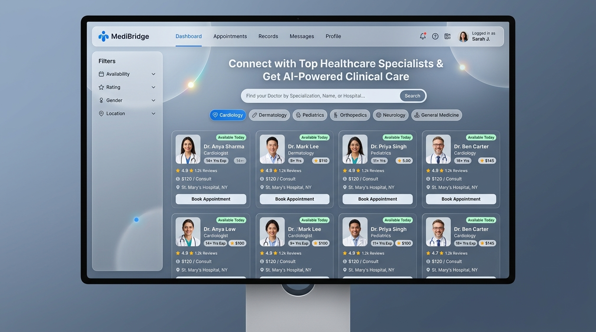
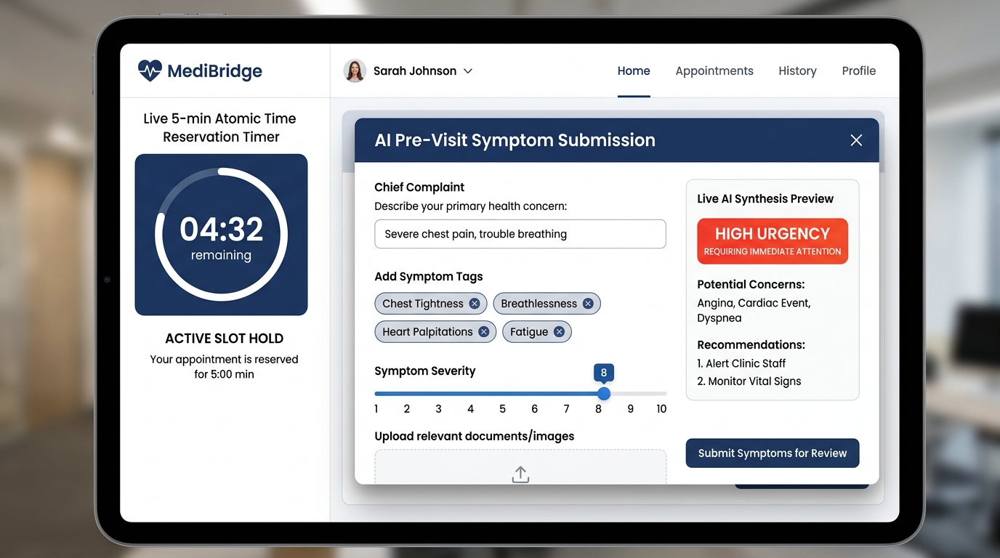
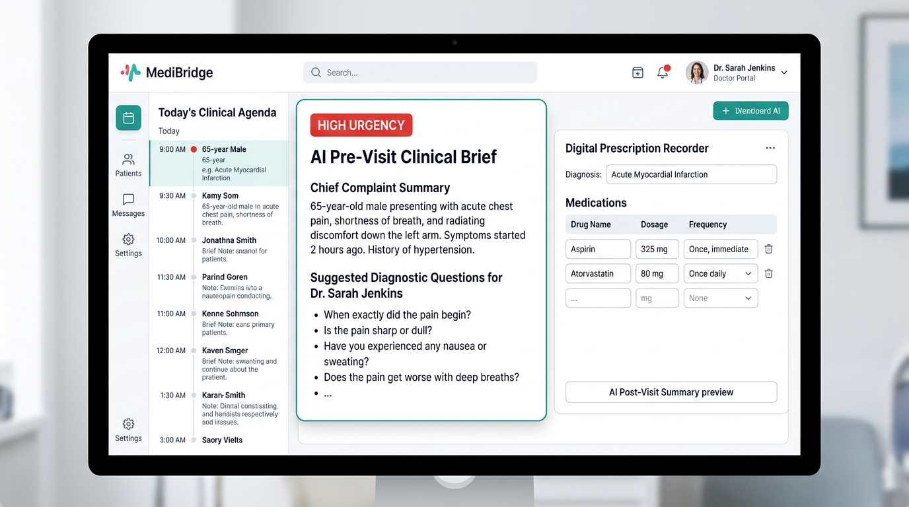
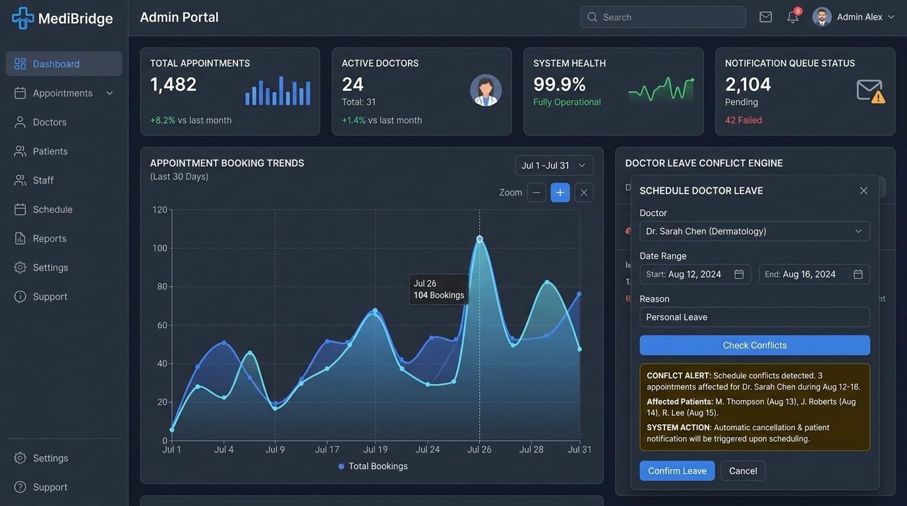
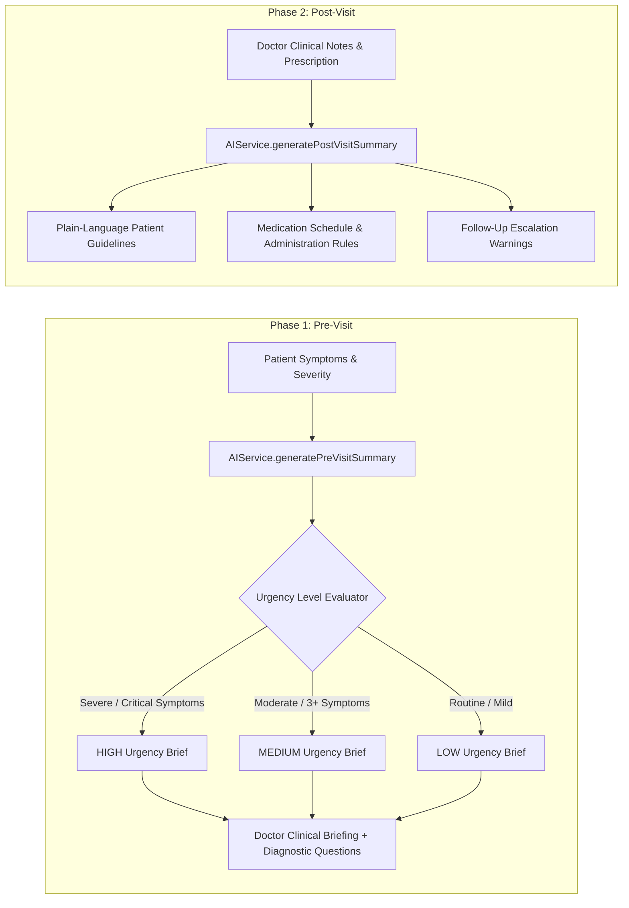
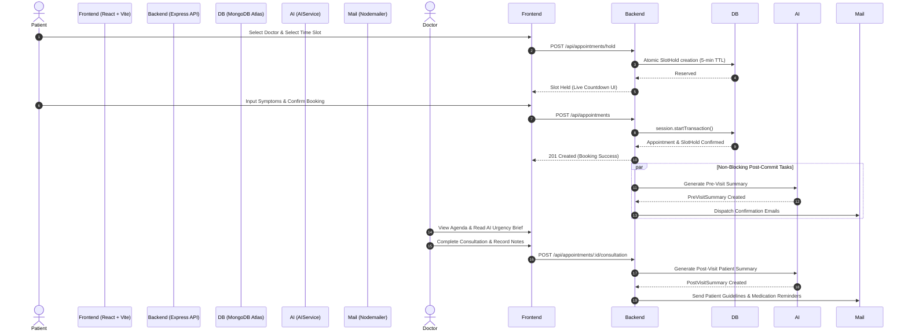

<div align="center">

# 🏥 MediBridge
### Next-Gen Healthcare Management & AI-Powered Clinical Summarizer

[](https://nodejs.org/)
[](https://www.typescriptlang.org/)
[](https://reactjs.org/)
[](https://vitejs.dev/)
[](https://www.mongodb.com/)
[](https://tailwindcss.com/)
[](https://deepmind.google/technologies/gemini/)
[](https://www.docker.com/)

<p align="center">
  A production-grade, full-stack Healthcare SaaS platform connecting <strong>Patients</strong>, <strong>Doctors</strong>, and <strong>Administrators</strong>. Features <strong>AI pre-visit clinical briefings</strong>, <strong>AI post-visit patient guidelines</strong>, <strong>concurrency-safe atomic slot reservations</strong>, <strong>doctor leave conflict resolution</strong>, <strong>exponential backoff notification retries</strong>, and <strong>Google Calendar OAuth 2.0 integration</strong>.
</p>

</div>

---

## 📋 Table of Contents

- [✨ Key Platform Features](#-key-platform-features)
- [🖼️ User Interface Showcase](#️-user-interface-showcase)
- [🤖 AI Summaries & LLM Integration Engine](#-ai-summaries--llm-integration-engine)
- [⚡ Concurrency Control & Double-Booking Prevention](#-concurrency-control--double-booking-prevention)
- [🏗️ System Architecture & Workflow](#️-system-architecture--workflow)
- [🗄️ Database Architecture (16 Collections)](#️-database-architecture-16-collections)
- [⚙️ Environment Variables Configuration](#️-environment-variables-configuration)
- [🚀 Local Setup & Execution Guide](#-local-setup--execution-guide)
- [🐳 Running with Docker Compose](#-running-with-docker-compose)
- [🧪 Concurrency Stress Testing](#-concurrency-stress-testing)
- [📡 API Reference Quick Guide](#-api-reference-quick-guide)
- [🔑 Demo Credentials](#-demo-credentials)

---

## ✨ Key Platform Features

### 🏥 Patient Portal
* **Doctor Discovery & Filtering**: Search physicians by name or medical specialization (*Cardiology, Dermatology, General Physician, Pediatrics, Orthopedics*).
* **Dynamic Slot Availability Generator**: Real-time time slot engine accounting for doctor working shift hours, break periods, existing appointments, active holds, and leaves.
* **5-Minute Atomic Slot Hold**: Hold time slots with a live UI countdown while filling in pre-visit medical symptom details.
* **AI Pre-Visit Symptom Submission**: Asynchronous AI synthesis converts self-assessed symptoms into structured clinical briefings for attending doctors.
* **Digital Prescriptions & Dosage Reminders**: Access prescriptions online and receive automated email reminders according to dosage frequency schedules.
* **Google Calendar Synchronization**: Non-blocking OAuth 2.0 sync to add booked consultations directly to patient Google Calendars.

### 🩺 Doctor Portal
* **Clinical Agenda Dashboard**: Daily timeline view of confirmed consultations and historical patient records.
* **AI Pre-Visit Urgency Briefings**: Instant view of AI-generated summaries with color-coded **Urgency Indicators** (`LOW`, `MEDIUM`, `HIGH`) and suggested diagnostic questions prior to starting the session.
* **Consultation & Digital Prescription Recorder**: Capture clinical diagnosis, treatment plans, clinical notes, and issue digital prescriptions.
* **AI Post-Visit Summary Generator**: Converts complex clinical consultation notes into plain-language follow-up guidelines for patients.
* **Shift & Availability Configuration**: Configure weekly working hours, break slots, and default consultation durations.

### 🛡️ Admin Portal
* **Real-time Analytics Dashboard**: Metrics and interactive charts (*Appointment trends, status disaggregation, revenue analytics*).
* **Doctor Directory Management**: Onboard new physicians, manage consultation fees, and assign medical specializations.
* **Doctor Leave Conflict Engine**: Schedule doctor leaves with automatic conflict analysis ("X appointments affected"), cancellation dispatches, and patient notifications.
* **Notification Queue Monitor**: Track email dispatches with manual retry triggers and exponential backoff states.
* **Immutable System Audit Logs**: Trace platform security events, user logins, and administrative actions.

---

## 🖼️ User Interface Showcase

| Portal & Feature | Interface Screenshot / Preview |
| :--- | :--- |
| **🏠 Landing Page & Doctor Search** |  |
| **🏥 Patient Portal & AI Symptom Submission** |  |
| **🩺 Doctor Agenda & AI Clinical Briefing** |  |
| **🛡️ Admin Analytics & Leave Conflict Engine** |  |

---

## 🤖 AI Summaries & LLM Integration Engine

MediBridge features a dual-phase AI clinical intelligence engine designed to bridge communication between patients and healthcare providers.



### 1. Pre-Visit Symptom Summarizer (`AIService.generatePreVisitSummary`)
When a patient submits their symptom form during booking:
1. **Urgency Classification**: Evaluates symptom severity keywords (`chest pain`, `breathlessness`, `bleeding`, `high fever`) and self-assessed severity to categorize into `LOW`, `MEDIUM`, or `HIGH` urgency.
2. **Clinical Brief Synthesis**: Summarizes chief complaint, duration, and patient context into concise medical phrasing for the attending doctor.
3. **Diagnostic Prompts**: Generates 3 targeted clinical prompts for the physician to guide consultation efficiency.

### 2. Post-Visit Patient Guidelines (`AIService.generatePostVisitSummary`)
When a physician concludes a consultation and saves clinical notes:
1. **Plain-Language Translation**: Decodes medical terminology into clear patient instructions.
2. **Structured Medication Schedule**: Formats drug names, dosages, frequencies, and special consumption instructions.
3. **Follow-Up Milestones**: Outlines recovery steps and warning signs that require urgent re-consultation.

### ⚙️ How to Configure LLM Integration (Google Gemini / OpenAI)
The platform is equipped with an intelligent, rule-compliant fallback parser and direct API integration capability:

1. **Environment Setup**: Set your LLM API Key in `backend/.env`:
   ```env
   # Google Gemini or OpenAI API Key
   LLM_API_KEY=your_gemini_or_openai_api_key_here
   ```
2. **Mock vs. Production Mode**:
   - **With `LLM_API_KEY` configured**: Connects to the external LLM endpoint to generate dynamic responses.
   - **Without `LLM_API_KEY` (Fallback Mode)**: Uses built-in deterministic clinical rule sets in [`aiService.ts`](file:///c:/Users/karan/OneDrive/Desktop/Unthinkable_Project/backend/src/integrations/aiService.ts) to generate instant summaries without external latency.

> [!IMPORTANT]
> **Clinical Safety Safeguard**: The AI summarizer operates under strict non-diagnostic boundaries. It never recommends unprescribed medications, invents unstated symptoms, or outputs binding diagnostic diagnoses.

---

## ⚡ Concurrency Control & Double-Booking Prevention

MediBridge guarantees zero double-booking under high request loads through a **Two-Tier Concurrency Architecture**:

```
[ Incoming Booking Request ]
             │
             ▼
┌───────────────────────────────────────────────────────────┐
│ 1. Atomic SlotHold Creation                               │
│    MongoDB Compound Unique Index:                         │
│    { doctorId: 1, startTime: 1, status: "HELD" }         │
│    TTL Index on expiresAt (Automatic 5-min Expiration)    │
└────────────────────────────┬──────────────────────────────┘
                             │ Success
                             ▼
┌───────────────────────────────────────────────────────────┐
│ 2. MongoDB Session Transaction (session.startTransaction) │
│    - Validates Working Hours & Doctor Leave Conflicts     │
│    - Checks Confirmed Collisions (doctorId + startTime)   │
│    - Atomically Creates Appointment Document             │
│    - Updates SlotHold status to "CONFIRMED"               │
│    - Commits ACID Transaction                             │
└────────────────────────────┬──────────────────────────────┘
                             │ Commit Success
                             ▼
┌───────────────────────────────────────────────────────────┐
│ 3. Asynchronous Non-Blocking Post-Commit Executions       │
│    - process.nextTick() triggers AI Pre-Visit Briefing    │
│    - Nodemailer dispatches Email Confirmation             │
│    - Syncs Event to Google Calendar via OAuth 2.0         │
└───────────────────────────────────────────────────────────┘
```

If a collision occurs:
* Database rejects concurrent requests atomically with error code `SLOT_ALREADY_BOOKED`.
* User UI receives an immediate non-blocking notification: `"This appointment slot is no longer available."`

---

## 🏗️ System Architecture & Workflow



---

## 🗄️ Database Architecture (16 Collections)

The MongoDB database consists of 16 decoupled schemas:

| # | Collection | Description | Key Indexes |
| :-: | :--- | :--- | :--- |
| **1** | `User` | User auth identity & role (`PATIENT`, `DOCTOR`, `ADMIN`) | `email` *(Unique)* |
| **2** | `Patient` | Patient demographics & emergency contacts | `userId` |
| **3** | `Doctor` | Doctor profile, specialization references, fee, working hours | `userId` |
| **4** | `Specialization` | Medical specializations directory | `name` *(Unique)* |
| **5** | `DoctorLeave` | Scheduled physician leave blocks | `doctorId`, `doctorId + startDate + endDate` |
| **6** | `SlotHold` | 5-minute atomic slot reservations | `expiresAt` *(TTL)*, `doctorId + startTime + status` *(Compound Unique)* |
| **7** | `Appointment` | Confirmed booking transactions | `doctorId + startTime`, `patientId + startTime`, `status` |
| **8** | `SymptomSubmission` | Patient pre-visit symptom submissions | `appointmentId` |
| **9** | `PreVisitSummary` | AI clinical briefings & urgency levels | `appointmentId`, `urgencyLevel` |
| **10** | `Consultation` | Diagnosis, clinical notes & treatment plans | `appointmentId` |
| **11** | `Prescription` | Issued medications with dosage & frequency | `consultationId` |
| **12** | `MedicationReminder` | Automated dosage reminder schedule | `status + nextReminderAt` |
| **13** | `Notification` | Email dispatches & retry queue status | `status + nextRetryAt` |
| **14** | `GoogleCalendarConnection` | OAuth 2.0 tokens for Google Calendar | `userId` *(Unique)* |
| **15** | `CalendarEvent` | Synced Google Calendar event IDs | `appointmentId` |
| **16** | `AuditLog` | Platform security & administrative audit trail | `userId + createdAt`, `entity + entityId` |

---

## ⚙️ Environment Variables Configuration

Create a `.env` file inside the `backend/` directory using `backend/.env.example` as a template:

```env
# Server Configuration
PORT=5000
NODE_ENV=development
FRONTEND_URL=http://localhost:3000
BACKEND_URL=http://localhost:5000

# Database
MONGODB_URI=mongodb://127.0.0.1:27017/healthcare_appointment_manager

# JWT Authentication
JWT_SECRET=your_jwt_secret_key_here
JWT_REFRESH_SECRET=your_jwt_refresh_secret_key_here
JWT_EXPIRES_IN=1d
JWT_REFRESH_EXPIRES_IN=7d

# Slot Reservation Rules
SLOT_HOLD_DURATION_MINUTES=5

# AI Integration (Google Gemini / OpenAI)
LLM_API_KEY=your_llm_api_key_optional

# Email / SMTP Configuration
EMAIL_HOST=smtp.ethereal.email
EMAIL_PORT=587
EMAIL_USER=your_smtp_user
EMAIL_PASSWORD=your_smtp_password
EMAIL_FROM="MediBridge Care" <no-reply@medibridge.com>

# Google Calendar OAuth 2.0 (Optional)
GOOGLE_CLIENT_ID=your_google_client_id
GOOGLE_CLIENT_SECRET=your_google_client_secret
GOOGLE_REDIRECT_URI=http://localhost:5000/api/google-calendar/callback

# Redis (Optional - for Queue support)
REDIS_URL=redis://127.0.0.1:6379
```

---

## 🚀 Local Setup & Execution Guide

### Prerequisites
* **Node.js**: `v20.x` or higher
* **npm**: `v10.x` or higher
* **MongoDB**: Local MongoDB instance (`mongodb://127.0.0.1:27017`) or MongoDB Atlas URI

### 1. Repository Setup & Dependencies

```bash
# Clone the repository
git clone https://github.com/K2005RAN/Healthcare-Appointment-Manager.git
cd Healthcare-Appointment-Manager

# Install Backend Dependencies
cd backend
npm install

# Install Frontend Dependencies
cd ../frontend
npm install
```

### 2. Database Seeding
Populate the database with medical specializations, admin user, 5 sample doctors, 5 patients, and demo appointments:

```bash
cd backend
npm run seed
```

### 3. Start Development Servers

Run backend and frontend servers in separate terminal windows:

```bash
# Terminal 1: Backend API (Port 5000)
cd backend
npm run dev

# Terminal 2: Frontend Vite App (Port 3000)
cd frontend
npm run dev
```

Navigate to **`http://localhost:3000`** in your browser.

---

## 🐳 Running with Docker Compose

To launch the complete stack (*MongoDB 7.0, Redis 7.2, Backend API, Frontend*) using Docker:

```bash
# Start all containers in detached mode
docker-compose up -d --build

# View container logs
docker-compose logs -f

# Stop containers
docker-compose down
```

---

## 🧪 Concurrency Stress Testing

To verify zero double-booking under simultaneous request spikes:

```bash
cd backend
npm run test:concurrency
```

**Expected Result**:
5 simultaneous HTTP booking requests are fired concurrently for the exact same doctor and time slot. Exactly **1 request succeeds (201 Created)** and **4 requests are rejected (409 Conflict)** with error code `SLOT_ALREADY_BOOKED`.

---

## 🔑 Demo Credentials

| Role | Email | Password | Access Rights |
| :--- | :--- | :--- | :--- |
| **🛡️ Admin** | `admin@example.com` | `admin123` | Analytics, Doctor Directory, Leave Management, Retry Queue, Audit Logs |
| **🩺 Doctor** | `sarah.jenkins@medibridge.com` | `password123` | Clinical Agenda, AI Urgency Briefs, Consultation & Prescription Recorder |
| **🏥 Patient** | `emily.watson@example.com` | `password123` | Doctor Search, Slot Hold & Booking, AI Symptoms Submission, Prescriptions |

---

## 📡 API Reference Quick Guide

### Auth & User Profile
| Method | Endpoint | Description | Auth |
| :--- | :--- | :--- | :--- |
| `POST` | `/api/auth/register` | Register new patient account | Public |
| `POST` | `/api/auth/login` | User authentication & JWT issuance | Public |
| `POST` | `/api/auth/refresh` | Refresh access token via HTTP-only cookie | Public |
| `GET` | `/api/auth/me` | Fetch current logged-in user details | Auth |

### Doctors & Availability
| Method | Endpoint | Description | Auth |
| :--- | :--- | :--- | :--- |
| `GET` | `/api/doctors` | List active doctors & search by specialization | Public |
| `GET` | `/api/doctors/:id/availability` | Generate dynamic available slots for date | Public / Patient |

### Appointments & AI Pipeline
| Method | Endpoint | Description | Auth |
| :--- | :--- | :--- | :--- |
| `POST` | `/api/appointments/hold` | Hold slot for 5 minutes (Atomic SlotHold) | PATIENT |
| `POST` | `/api/appointments` | Confirm appointment (ACID Transaction) | PATIENT |
| `POST` | `/api/appointments/:id/symptoms` | Submit symptoms & trigger AI Pre-Visit Briefing | PATIENT |
| `POST` | `/api/appointments/:id/consultation` | Record consultation, prescription & AI Post-Visit | DOCTOR |
| `GET` | `/api/patient/summaries` | View AI post-visit guidelines & medications | PATIENT |

### Admin Management
| Method | Endpoint | Description | Auth |
| :--- | :--- | :--- | :--- |
| `GET` | `/api/admin/dashboard` | Platform metrics & appointment analytics | ADMIN |
| `POST` | `/api/admin/doctors` | Onboard new physician | ADMIN |
| `POST` | `/api/admin/doctors/:id/leave` | Create doctor leave with conflict engine | ADMIN |
| `GET` | `/api/admin/notifications` | Monitor failed notification queue & retry dispatches | ADMIN |
| `GET` | `/api/admin/audit-logs` | Platform security & action audit logs | ADMIN |

---

<div align="center">
  <sub>Built with ❤️ for modern healthcare management. MediBridge © 2026</sub>
</div>
